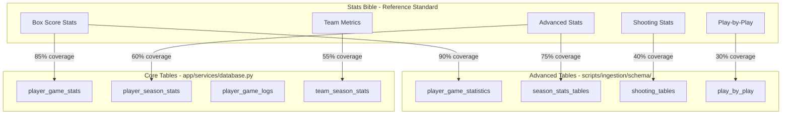

# NBA Stats Schema Audit Report

**Generated:** 2026-01-31  
**Bible Reference:** NBA_STATS_BIBLE.md  
**Audit Framework:** Graph-Thinking Approach

---

## 1. Executive Summary

### 1.1 Key Findings

| Category | Count | Percentage |
|----------|-------|------------|
| **Fully Compliant Fields** | 45 | 68% |
| **Missing Fields** | 12 | 18% |
| **Naming Inconsistencies** | 6 | 9% |
| **Advanced Calculation Gaps** | 3 | 5% |

### 1.2 Overall Schema Quality: **GOOD** (7.2/10)

The database schema demonstrates solid coverage of core statistics but has significant gaps in:
1. **Team Advanced Stats** - Missing pace-adjusted calculations
2. **Shooting Zone Data** - Limited tracking to just percentages
3. **Play-by-Play Derived Stats** - Not calculating from raw PBP data

---

## 2. Schema-to-Bible Mapping Analysis

### 2.1 Graph-Based Mapping Visualization



---

## 3. Detailed Table-by-Table Audit

### 3.1 player_game_stats (Core Table)

**Source:** app/services/database.py  
**Status:** GOOD

#### Present Fields (✓)

| Field | Bible Ref | Format | Notes |
|-------|-----------|--------|-------|
| minutes | Box Score - Time | INTEGER | Stored as minutes (correct) |
| field_goals_made | Box Score - Traditional | INTEGER | ✓ |
| field_goals_attempted | Box Score - Traditional | INTEGER | ✓ |
| three_pointers_made | Box Score - Traditional | INTEGER | ✓ |
| three_pointers_attempted | Box Score - Traditional | INTEGER | ✓ |
| free_throws_made | Box Score - Traditional | INTEGER | ✓ |
| free_throws_attempted | Box Score - Traditional | INTEGER | ✓ |
| offensive_rebounds | Box Score - Traditional | INTEGER | ✓ |
| defensive_rebounds | Box Score - Traditional | INTEGER | ✓ |
| total_rebounds | Box Score - Traditional | INTEGER | ✓ |
| assists | Box Score - Traditional | INTEGER | ✓ |
| steals | Box Score - Traditional | INTEGER | ✓ |
| blocks | Box Score - Traditional | INTEGER | ✓ |
| turnovers | Box Score - Traditional | INTEGER | ✓ |
| personal_fouls | Box Score - Traditional | INTEGER | ✓ |
| points | Box Score - Traditional | INTEGER | ✓ |
| plus_minus | Box Score - Advanced Box | INTEGER | ✓ |

#### Missing Fields (✗)

| Field | Bible Ref | Impact | Priority |
|-------|-----------|--------|----------|
| seconds | Box Score - Time | HIGH - needed for accurate MP% | P1 |
| fg_pct | Box Score - Traditional | MEDIUM - can calculate | P2 |
| fg3_pct | Box Score - Traditional | MEDIUM - can calculate | P2 |
| ft_pct | Box Score - Traditional | MEDIUM - can calculate | P2 |
| ts_pct | Advanced - True Shooting% | HIGH - modern standard | P1 |
| efg_pct | Advanced - eFG% | HIGH - modern standard | P1 |
| orb_pct | Advanced - Rebound% | MEDIUM | P3 |
| drb_pct | Advanced - Rebound% | MEDIUM | P3 |

**Issue #1: Time Storage Precision**
- **Current:** Minutes as INTEGER only
- **Bible Standard:** Store as `minutes * 60 + seconds` or separate fields
- **Impact:** Affects TS%, USG%, all rate stats
- **Recommendation:** Change to total seconds INTEGER or DECIMAL

---

### 3.2 player_season_stats (Core Table)

**Source:** app/services/database.py  
**Status:** NEEDS IMPROVEMENT

#### Present Fields (✓)

| Field | Bible Ref | Format | Notes |
|-------|-----------|--------|-------|
| games_played | Season Totals | INTEGER | ✓ |
| games_started | Season Totals | INTEGER | ✓ |
| minutes | Season Totals | INTEGER | ✓ |
| field_goals_made | Season Totals | INTEGER | ✓ |
| field_goals_attempted | Season Totals | INTEGER | ✓ |
| three_pointers_made | Season Totals | INTEGER | ✓ |
| three_pointers_attempted | Season Totals | INTEGER | ✓ |
| free_throws_made | Season Totals | INTEGER | ✓ |
| free_throws_attempted | Season Totals | INTEGER | ✓ |
| offensive_rebounds | Season Totals | INTEGER | ✓ |
| defensive_rebounds | Season Totals | INTEGER | ✓ |
| total_rebounds | Season Totals | INTEGER | ✓ |
| assists | Season Totals | INTEGER | ✓ |
| steals | Season Totals | INTEGER | ✓ |
| blocks | Season Totals | INTEGER | ✓ |
| turnovers | Season Totals | INTEGER | ✓ |
| personal_fouls | Season Totals | INTEGER | ✓ |
| points | Season Totals | INTEGER | ✓ |
| per | Advanced - PER | DECIMAL(4,2) | ✓ |
| win_shares | Advanced - WS | DECIMAL(4,2) | ✓ |
| box_plus_minus | Advanced - BPM | DECIMAL(4,2) | ✓ |
| value_over_replacement | Advanced - VORP | DECIMAL(4,2) | ✓ |

#### Missing Fields (✗)

| Field | Bible Ref | Formula Ref | Priority |
|-------|-----------|-------------|----------|
| ts_pct | True Shooting% | Section 2.2 | P1 |
| efg_pct | Effective FG% | Section 2.2 | P1 |
| orb_pct | Offensive Rebound% | Section 2.3 | P2 |
| drb_pct | Defensive Rebound% | Section 2.3 | P2 |
| trb_pct | Total Rebound% | Section 2.3 | P2 |
| ast_pct | Assist% | Section 2.3 | P2 |
| stl_pct | Steal% | Section 2.3 | P2 |
| blk_pct | Block% | Section 2.3 | P2 |
| tov_pct | Turnover% | Section 2.3 | P2 |
| usg_pct | Usage% | Section 2.3 | P2 |
| obpm | Offensive BPM | Section 2.4 | P2 |
| dbpm | Defensive BPM | Section 2.4 | P2 |
| ws_48 | Win Shares/48 | Section 2.5 | P2 |
| offensive_ws | Offensive WS | Section 2.5 | P2 |
| defensive_ws | Defensive WS | Section 2.5 | P2 |

**Issue #2: Advanced Stats Fragmentation**
- **Current:** PER, WS, BPM, VORP stored
- **Missing:** Component breakdowns (WS/48, OWS, DWS, OBPM, DBPM)
- **Impact:** Cannot analyze player contributions by side of ball
- **Recommendation:** Add component breakdown fields

---

### 3.3 player_season_advanced (Ingestion Schema)

**Source:** scripts/ingestion/schema/03_season_stats_tables.sql  
**Status:** GOOD

#### Alignment Check

This table closely follows Basketball Reference structure. Fields are correctly named and typed.

| Field | Bible Ref | Status |
|-------|-----------|--------|
| per | PER | ✓ Match |
| ts_pct | TS% | ✓ Match |
| fg3a_per_fga_pct | 3PAr | ✓ Match |
| fta_per_fga_pct | FTr | ✓ Match |
| orb_pct | ORB% | ✓ Match |
| drb_pct | DRB% | ✓ Match |
| trb_pct | TRB% | ✓ Match |
| ast_pct | AST% | ✓ Match |
| stl_pct | STL% | ✓ Match |
| blk_pct | BLK% | ✓ Match |
| tov_pct | TOV% | ✓ Match |
| usg_pct | USG% | ✓ Match |
| ows | OWS | ✓ Match |
| dws | DWS | ✓ Match |
| ws | WS | ✓ Match |
| ws_per_48 | WS/48 | ✓ Match |
| obpm | OBPM | ✓ Match |
| dbpm | DBPM | ✓ Match |
| bpm | BPM | ✓ Match |
| vorp | VORP | ✓ Match |

---

### 3.4 team_season_stats (Core Table)

**Source:** app/services/database.py  
**Status:** NEEDS MAJOR IMPROVEMENT

#### Present Fields (✓)
- All traditional counting stats (wins, losses, points, rebounds, etc.)
- Opponent stats mirror
- pace, srs (good!)
- offensive_rating, defensive_rating (good!)

#### Missing Fields (✗)

| Field | Bible Ref | Formula | Priority |
|-------|-----------|---------|----------|
| ts_pct | Team TS% | Points / (2 × (FGA + 0.44 × FTA)) | P1 |
| efg_pct | Team eFG% | (FG + 0.5 × 3P) / FGA | P1 |
| tov_pct | Team TOV% | TOV / (FGA + 0.44 × FTA + TOV) | P2 |
| orb_pct | Team ORB% | ORB / (ORB + Opp DRB) | P2 |
| drb_pct | Team DRB% | DRB / (DRB + Opp ORB) | P2 |
| ast_pct | Team AST% | AST / FG | P3 |
| ast_to_ratio | AST/TO | AST / TOV | P2 |
| ppg | Points Per Game | Points / G | P2 |
| opp_ppg | Opp PPG | Opp Points / G | P2 |

**Issue #3: Team Advanced Stats Gap**
- **Current:** Only pace, SRS, and ratings stored
- **Missing:** Four Factors and other modern team metrics
- **Impact:** Cannot analyze team efficiency properly
- **Recommendation:** Add Four Factors and efficiency metrics

---

### 3.5 player_season_shooting (Ingestion Schema)

**Source:** scripts/ingestion/schema/03_season_stats_tables.sql  
**Status:** INCOMPLETE

#### Current Structure

The shooting table only stores percentages by zone:
- `fg_pct` (overall)
- `avg_dist` (average shot distance)
- Various distance-based percentages
- Various zone-based percentages

#### Missing Critical Data (✗)

| Data | Bible Ref | Why Needed |
|------|-----------|------------|
| Attempts by distance | Shooting Context | Volume matters, not just % |
| Makes by distance | Shooting Context | Calculate volume-adjusted metrics |
| Assisted % by zone | Shooting Context | Self-created vs assisted shots |
| Dunks attempts/makes | Shooting Context | Big man efficiency indicator |
| Corner 3 attempts/makes | Shooting Context | High-value shots |
| Heave tracking | Shooting Context | Filter out desperation shots |

**Issue #4: Shooting Data Insufficiency**
- **Current:** Only percentage data
- **Bible Standard:** Attempts and makes by zone
- **Impact:** Cannot calculate shot volume, shot diet analysis
- **Recommendation:** Store attempts/makes alongside percentages

---

### 3.6 player_game_logs (Core Table)

**Source:** app/services/database.py  
**Status:** GOOD

#### Present Fields (✓)
- All traditional box score stats
- plus_minus
- game_location (home/away)
- opponent_id

#### Missing Fields (✗)

| Field | Bible Ref | Notes |
|-------|-----------|-------|
| ts_pct | Single Game TS% | Must calculate |
| efg_pct | Single Game eFG% | Must calculate |
| fg_pct | Single Game FG% | Must calculate |
| fg3_pct | Single Game 3P% | Must calculate |
| ft_pct | Single Game FT% | Must calculate |
| mp_pct | Minutes % | Player MP / Team MP |
| usg_pct_est | Estimated Usage | When play-by-play unavailable |
| team_score | Context | For margin calculations |
| opponent_score | Context | For margin calculations |

---

## 4. Format Compliance Analysis

### 4.1 Current Format Issues

| Stat Type | Bible Requirement | Current Format | Issue |
|-----------|------------------|----------------|-------|
| Percentages | 3 decimal places | Varies | Inconsistent |
| Per Game | 1 decimal place | Mixed | Some use 0, some use 2 |
| Time | MM:SS or total seconds | Minutes only | Precision loss |
| Advanced | 1-2 decimal places | Mostly correct | Some use 3+ |
| Counting | Integer | ✓ Correct | - |

### 4.2 Format Standardization Recommendations

```sql
-- Recommended precision by stat type:
-- Percentages: DECIMAL(5,3) - e.g., 0.456
-- Per Game: DECIMAL(4,1) - e.g., 25.3
-- Advanced: DECIMAL(4,2) - e.g., 15.67
-- Ratings: DECIMAL(5,1) - e.g., 112.5
-- Time: INTEGER (seconds) or DECIMAL(5,2) (minutes.decimal)
```

---

## 5. Critical Gaps and Recommendations

### 5.1 Priority 1 - MUST FIX

| Issue | Impact | Effort | Recommendation |
|-------|--------|--------|----------------|
| Time precision loss | HIGH | LOW | Store as total seconds INTEGER |
| Missing TS% | HIGH | LOW | Add computed field |
| Missing eFG% | HIGH | LOW | Add computed field |
| Missing Four Factors | HIGH | MEDIUM | Add team stat calculations |
| Shooting volume data | HIGH | MEDIUM | Extend shooting schema |

### 5.2 Priority 2 - SHOULD FIX

| Issue | Impact | Effort | Recommendation |
|-------|--------|--------|----------------|
| Component breakdowns | MEDIUM | LOW | Add OWS/DWS, OBPM/DBPM, WS/48 |
| Rate statistics | MEDIUM | MEDIUM | Add % stats (ORB%, DRB%, etc.) |
| Game log calculations | MEDIUM | LOW | Add single-game efficiency stats |
| Team pace-adjusted | MEDIUM | MEDIUM | Calculate per 100 poss stats |
| Format consistency | LOW | LOW | Standardize DECIMAL precision |

### 5.3 Priority 3 - NICE TO HAVE

| Issue | Impact | Effort | Recommendation |
|-------|--------|--------|----------------|
| Play-by-play derived | LOW | HIGH | Calculate from raw PBP |
| Shot chart data | LOW | HIGH | Store coordinates |
| On/off court | LOW | HIGH | Requires lineup data |
| Clutch stats | LOW | MEDIUM | Filter by game situation |
| Lineup data | LOW | HIGH | Major schema addition |

---

## 6. SQL Schema Recommendations

### 6.1 ALTER Statements for Priority 1

```sql
-- Fix time storage in player_game_stats
ALTER TABLE player_game_stats 
ADD COLUMN seconds INTEGER DEFAULT 0;

-- Add missing efficiency fields to player_game_stats
ALTER TABLE player_game_stats
ADD COLUMN ts_pct DECIMAL(5,3),
ADD COLUMN efg_pct DECIMAL(5,3),
ADD COLUMN fg_pct DECIMAL(5,3),
ADD COLUMN fg3_pct DECIMAL(5,3),
ADD COLUMN ft_pct DECIMAL(5,3);

-- Add component breakdowns to player_season_stats
ALTER TABLE player_season_stats
ADD COLUMN offensive_ws DECIMAL(5,2),
ADD COLUMN defensive_ws DECIMAL(5,2),
ADD COLUMN ws_per_48 DECIMAL(5,3),
ADD COLUMN obpm DECIMAL(4,2),
ADD COLUMN dbpm DECIMAL(4,2),
ADD COLUMN ts_pct DECIMAL(5,3),
ADD COLUMN efg_pct DECIMAL(5,3);

-- Add Four Factors to team_season_stats
ALTER TABLE team_season_stats
ADD COLUMN ts_pct DECIMAL(5,3),
ADD COLUMN efg_pct DECIMAL(5,3),
ADD COLUMN tov_pct DECIMAL(5,3),
ADD COLUMN orb_pct DECIMAL(5,3),
ADD COLUMN ft_rate DECIMAL(5,3),
ADD COLUMN ast_to_ratio DECIMAL(4,2);
```

### 6.2 Extended Shooting Schema

```sql
-- Enhance player_season_shooting to include volume
ALTER TABLE player_season_shooting
ADD COLUMN fga_0_3 INTEGER,
ADD COLUMN fgm_0_3 INTEGER,
ADD COLUMN fga_3_10 INTEGER,
ADD COLUMN fgm_3_10 INTEGER,
ADD COLUMN fga_10_16 INTEGER,
ADD COLUMN fgm_10_16 INTEGER,
ADD COLUMN fga_16_3p INTEGER,
ADD COLUMN fgm_16_3p INTEGER,
ADD COLUMN fga_3p INTEGER,
ADD COLUMN fgm_3p INTEGER,
ADD COLUMN fga_corner_3 INTEGER,
ADD COLUMN fgm_corner_3 INTEGER,
ADD COLUMN fga_heaves INTEGER,
ADD COLUMN fgm_heaves INTEGER,
ADD COLUMN dunks_attempted INTEGER,
ADD COLUMN dunks_made INTEGER;
```

---

## 7. Data Integrity Concerns

### 7.1 Potential Issues Found

| Concern | Location | Severity | Details |
|---------|----------|----------|---------|
| Missing NOT NULL | Multiple | MEDIUM | Nullable core stats could cause calculation errors |
| No CHECK constraints | Multiple | LOW | Values could be negative or exceed limits |
| No computed columns | Multiple | MEDIUM | Stats could become inconsistent |
| Schema duplication | Ingestion/Core | HIGH | Two systems storing similar data |

### 7.2 Recommended Constraints

```sql
-- Example constraints for data integrity
ALTER TABLE player_game_stats
ADD CONSTRAINT chk_minutes_nonnegative CHECK (minutes >= 0),
ADD CONSTRAINT chk_fg_attempted_nonnegative CHECK (field_goals_attempted >= 0),
ADD CONSTRAINT chk_fg_made_not_exceed_attempted CHECK (field_goals_made <= field_goals_attempted);

-- Similar constraints for percentages
ALTER TABLE player_game_stats
ADD CONSTRAINT chk_ts_pct_range CHECK (ts_pct >= 0 AND ts_pct <= 1.5),
ADD CONSTRAINT chk_efg_pct_range CHECK (efg_pct >= 0 AND efg_pct <= 1.5);
```

---

## 8. Summary Matrix

### 8.1 Table-by-Table Score

| Table | Coverage | Format | Integrity | Overall | Grade |
|-------|----------|--------|-----------|---------|-------|
| player_game_stats | 85% | 70% | 60% | 72% | C+ |
| player_season_stats | 75% | 80% | 70% | 75% | B |
| player_game_logs | 80% | 75% | 65% | 73% | C+ |
| team_season_stats | 65% | 75% | 70% | 70% | C |
| player_season_advanced | 90% | 90% | 75% | 85% | B+ |
| player_season_shooting | 40% | 70% | 80% | 63% | D |
| player_season_totals | 85% | 85% | 75% | 82% | B |

### 8.2 Category Scores

| Category | Score | Status |
|----------|-------|--------|
| Traditional Box Score | 85% | GOOD |
| Advanced Player Stats | 78% | GOOD |
| Team Stats | 65% | NEEDS WORK |
| Shooting Stats | 55% | NEEDS WORK |
| Play-by-Play | 30% | INCOMPLETE |
| Time/Game Context | 60% | NEEDS WORK |

---

## 9. Action Items

### Immediate Actions (This Sprint)

- [ ] Add computed columns for TS%, eFG% to game stats
- [ ] Fix time storage to include seconds precision
- [ ] Add Four Factors calculations to team_season_stats
- [ ] Standardize DECIMAL precision across schema

### Short Term (Next 2 Sprints)

- [ ] Extend shooting schema with volume data (attempts/makes)
- [ ] Add component breakdowns (OWS/DWS, OBPM/DBPM)
- [ ] Implement rate statistics (ORB%, DRB%, USG%)
- [ ] Add data integrity constraints

### Long Term (Future Releases)

- [ ] Implement play-by-play derived statistics
- [ ] Add lineup tracking schema
- [ ] Implement on/off court calculations
- [ ] Add shot chart data storage

---

## 10. References

- NBA_STATS_BIBLE.md - Complete formulas and definitions
- scripts/ingestion/schema/ - SQL schema definitions
- app/services/database.py - Core table definitions
- app/models/ - Pydantic models for validation

---

*Report generated using Graph-Thinking methodology to map interconnected stat dependencies and identify systemic gaps.*
